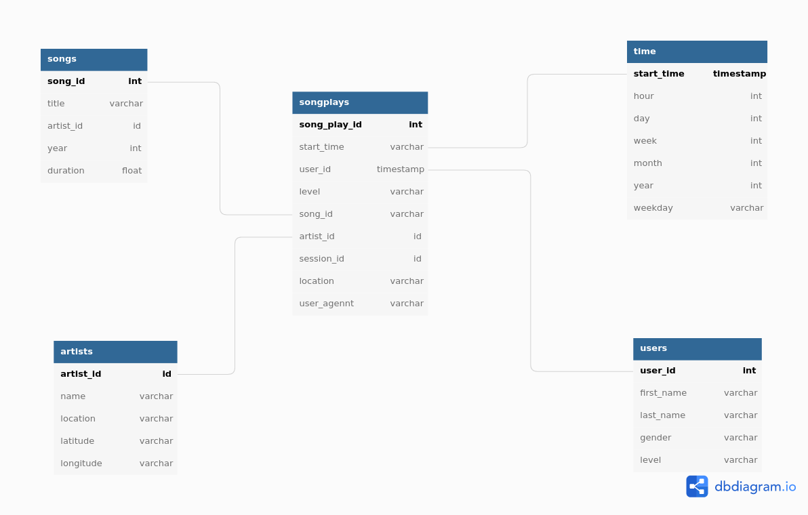

# Modelagem de dados com Postgre

Neste projeto, iremos criar um banco de dados no postgre `sparkifydb` para o aplicativo de música, Sparkify. O objetivo é modelar o conjunto de dados presentes nos arquivos *Song_data*, que presenta as músicas executadas e nos arquivos *Log_data*, que indica os artistas e as músicas presentes no aplicativo. O schema de dados utilizado foi o star schema para otimizar as queries analíticas. 

# Designer do schema e ETL pipeline 

O star schema possui uma tabela fato (songplays)  e 4 tabelas de dimensões (songs, users, artists, time). `Drop', `CREATE`, `INSERT' e `SELECT`queries são definidas em `sql_queries.py`. **Create_tables.py** utiliza as funções `create_databse` , `drop_tables`e  `create_tables` para criar o banco de dados sparifydb e suas tabelas. 



O processo de Extração,transformação e carga acontece por meio do script **etl.py**. Nas tabelas **artist** e **songs** são inseridos os dados presentes nos arquivos `data/song_data`.Por outro lado, o arquivo json `data/log_file`é utilizado para realizar a carga dos dados nas tabelas **time**, **users** e , por fim, a tabela **songsplays** é preenchida com base em informações de ambos arquivos, formando então nossa tabela fato. 


# Criando o container com o docker 

Para não precisar instalar o postgree em minha máquina, eu criei um container utilizando docker. Utilizei a imagem **postgres-student** que criei especificamente para esse projeto.

Para realizar o download da imagem, instale o docker , crie um login e uma senha. No terminal, realize-se o login docker hub (via terminal)

```
docker login docker .io

```
Push da imagem do container 

```
docker push henrysilva/postgres-student
```
Inicializando o container 

```
docker run -d --name postgres-servidor -p 5432:5432 henrysilva/postgres-student
```
A conecão com o container pode ser realizar por meio dos seguintes parâmetros: 
`conn = psycopg2.connect("host=127.0.0.1 dbname=sparkifydb user=usuario password=1234")`

Para pausar ou remover o container

```
docker stop  postgres-servidor

docker rm  postgres-servidor
```
